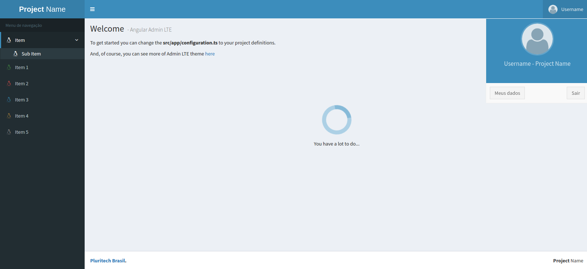

## Angular AdminLTE

### Angular2 Administrative Panel with AdminLTE Template

This project is a starter Angular project of an admin panel with AdminLTE template.


<p align="center">
  
</p>

### How to use?

* Clone the repository
* Rename the folder and update the package.json
* Delete .git repository
* Start a new git
* Configurate your project

### Configure the project

Open app/configuration.ts and fill the following fields.
```typescript
export const configuration = {
  projectName : {
    firstName: 'Project',
    lastName: 'Name',
    minimalName: 'PN'
  },
  localStorageKey: 'PROJECT-NAME-APP',
  logoPath: 'assets/panel.png',
  skin: 'skin-blue',
  userDefaultImage: 'assets/default-user.png',
  serverErrorEndpoint: '',
};
```
The available skins are from AdminLTE template. So, you can access the documentation [here](https://adminlte.io/themes/AdminLTE/documentation/index.html)


